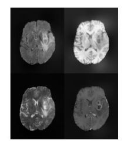
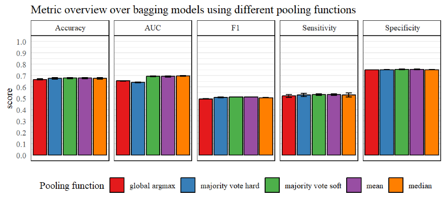
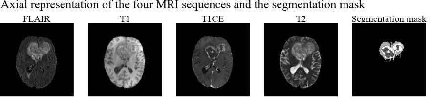
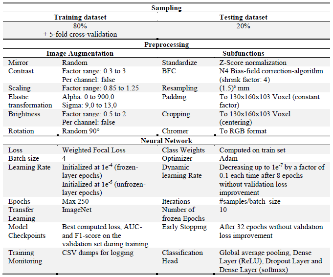

# Predicting Overall Survival of Glioblastoma Patients Using Deep Learning Classification Based on MRIs

Glioblastoma (GBM) is one of the most aggressive tumors of the brain. Despite intensive treatment, the average overall survival (OS) is 15-18 months.Therefore, it is helpful to be able to assess a patient's OS to tailor treatment more specifically to the course of the disease. Automated analysis of routinely generated MRI sequences (FLAIR, T1, T1CE and T2) using deep learning based image classification has the potential to enable accurate OS predictions.

This project was developed in cooperation with Dr. Santiago Cepeda (Department of Neurosurgery of the Río Hortega University Hospital). In this work we developed and evaluated a reproducible method to classify the OS into three classes - “short”, “medium” and “long”. For this purpose, the four MRI sequences FLAIR, T1, T1CE and T2 of a person were merged into one image. 

The pipeline consists of state-of-the-art preprocessing and image augmentation methods. We used bagging models realized by five-fold cross-validation and the ResNet50 architecture combined by five different pooling functions. 
It was applied on a dataset consisting of four publicity avaiable medical imaging datasets.

## Results

The models resulted in similar scores regarding all metrics and the variance between the classes proved to be very low. Our results revealed that a clear differentiation of the “short” and “long” classes is possible, which offers high clinical significance as decision support.

Performance results for the pipeline showing the achieved Accuracy, AUC, F1-score, Sensitivity and Specificity with its variance between the classes of the five different bagging models regarding the pooling functions.

## Dataset
The dataset includes as subsets the BraTS 2020 dataset, the RHUH-GBM dataset, the UPenn-GBM and the UCSF-PDGM dataset. The RHUH-GBM dataset was used in its entirety, whereas the remaining datasets were only partially included. The selection criteria for the samples used were defined as follows:  
 (1) Presence of a confirmed diagnosis of glioblastoma    
 (2) Presence of an age indication    
 (3) Availability of overall survival in days   

We redefined the **classes** based on a K-means Clusterung for three groups:   
    - *short:* OS < 170 days   
    - *medium:* OS between 170 and 599 days  
    - *long:* OS > 599 days   

**Segmentation mask:** true - 0 (no tumor), 1 (necrosis: NCR/NET), 2 (peritumoral signal alteration, including edema and nonenhancing tumor: ED), and 3 (enhancing tumor: ET).  

**Size:** 1128 images per modality  
**Included:**  
    - BratTS 2020: 550 images  
    - RHUH-GBM: 40 images  
    - UPenn-GBM: 452 images  
    - USCF-PDGM: 401 images  

#### BraTS: 
**Classes:** 3 - short (OS < 10 months), medium (OS between 10 to 15 months), long (OS > 15 months)   
**Segmentation mask:** true - 0 (no tumor), 1 (NCR/NET), 2 (ED) and 4 (ET)   
**Size:** 660 images per modality    
**Source with short description:** https://www.kaggle.com/datasets/awsaf49/brats2020-training-data/data and https://www.med.upenn.edu/cbica/brats2020/data.html   
##### References:
[1] B. H. Menze, A. Jakab, S. Bauer, J. Kalpathy-Cramer, K. Farahani, J. Kirby, et al. "The Multimodal Brain Tumor Image Segmentation Benchmark (BRATS)", IEEE Transactions on Medical Imaging 34(10), 1993-2024 (2015) DOI: 10.1109/TMI.2014.2377694 (opens in a new window) 
[2] S. Bakas, H. Akbari, A. Sotiras, M. Bilello, M. Rozycki, J.S. Kirby, et al., "Advancing The Cancer Genome Atlas glioma MRI collections with expert segmentation labels and radiomic features", Nature Scientific Data, 4:170117 (2017) DOI: 10.1038/sdata.2017.117(opens in a new window) 
[3] S. Bakas, M. Reyes, A. Jakab, S. Bauer, M. Rempfler, A. Crimi, et al., "Identifying the Best Machine Learning Algorithms for Brain Tumor Segmentation, Progression Assessment, and Overall Survival Prediction in the BRATS Challenge", arXiv preprint arXiv:1811.02629 (2018) 

#### RHUH-GBM:  
**Classes:** 3 - short (OS < 170 days), medium (OS between 170 and 599 days), long (OS > 599 days)   
**Segmentation mask:** true - 0 (no tumor), 1 (NCR/NET), 2 (ED) and 3 (ET)  
**Size:** 40 images per modality  
**Source with short description:** https://www.cancerimagingarchive.net/collection/rhuh-gbm/  
##### References:
[4]Cepeda, S., García-García, S., Arrese, I., Herrero, F., Escudero, T., Zamora, T.,  & Sarabia, R. (2023) The Río Hortega University Hospital Glioblastoma dataset: a comprehensive collection of preoperative, early postoperative and recurrence MRI scans (RHUH-GBM) [Dataset]. The Cancer Imaging Archive. https://doi.org/10.7937/4545-c905  
[5]Cepeda, S., García-García, S., Arrese, I., Herrero, F., Escudero, T., Zamora, T., & Sarabia, R. (2023). The Río Hortega University Hospital Glioblastoma dataset: A comprehensive collection of preoperative, early postoperative and recurrence MRI scans (RHUH-GBM). In Data in Brief (Vol. 50, p. 109617). Elsevier BV. https://doi.org/10.1016/j.dib.2023.109617  
[6]Clark, K., Vendt, B., Smith, K., Freymann, J., Kirby, J., Koppel, P., Moore, S., Phillips, S., Maffitt, D., Pringle, M., Tarbox, L., & Prior, F. (2013). The Cancer Imaging Archive (TCIA): Maintaining and Operating a Public Information Repository. In Journal of Digital Imaging (Vol. 26, Issue 6, pp. 1045–1057). Springer Science and Business Media LLC. https://doi.org/10.1007/s10278-013-9622-7  

#### UPenn-GBM: 
**Classes:** no classes - OS data present for 452 patients   
**Segmentation mask:** true - 0 (no tumor), 1 (NCR/NET), 2 (ED) and 4 (ET)   
**Size:** 611 images per modality   
**Source with short description:** https://www.cancerimagingarchive.net/collection/upenn-gbm/   
##### References:
[7]Bakas, S., Sako, C., Akbari, H., Bilello, M., Sotiras, A., Shukla, G., Rudie, J. D., Flores Santamaria, N., Fathi Kazerooni, A., Pati, S., Rathore, S., Mamourian, E., Ha, S. M., Parker, W., Doshi, J., Baid, U., Bergman, M., Binder, Z. A., Verma, R., … Davatzikos, C. (2021). Multi-parametric magnetic resonance imaging (mpMRI) scans for de novo Glioblastoma (GBM) patients from the University of Pennsylvania Health System (UPENN-GBM) (Version 2) [Data set]. The Cancer Imaging Archive. https://doi.org/10.7937/TCIA.709X-DN49  
[8]Bakas, S., Sako, C., Akbari, H., Bilello, M., Sotiras, A., Shukla, G., Rudie, J. D., Flores Santamaria, N., Fathi Kazerooni, A., Pati, S., Rathore, S., Mamourian, E., Ha, S. M., Parker, W., Doshi, J., Baid, U., Bergman, M., Binder, Z. A., Verma, R., Lustig, R., Desai, A. S., Bagley, S. J., Mourelatos, Z., Morrissette, J., Watt, C. D., Brem, S., Wolf, R. L., Melhem, E. R., Nasrallah, M. P., Mohan, S., O’Rourke, D. M., Davatzikos, C. (2022). The University of Pennsylvania glioblastoma (UPenn-GBM) cohort: advanced MRI, clinical, genomics, & radiomics. In Scientific Data (Vol. 9, Issue 1). https://doi.org/10.1038/s41597-022-01560-7  
[9]Clark, K., Vendt, B., Smith, K., Freymann, J., Kirby, J., Koppel, P., Moore, S., Phillips, S., Maffitt, D., Pringle, M., Tarbox, L., & Prior, F. (2013). The Cancer Imaging Archive (TCIA): Maintaining and Operating a Public Information Repository. Journal of Digital Imaging, 26(6), 1045–1057. https://doi.org/10.1007/s10278-013-9622-7  

#### UCSF-PDGM: 
**Classes: no classes** - OS data present   
**Segmentation mask:** true - 0 (no tumor), 1 (NCR/NET), 2 (ED) and 4 (ET)   
**Size:** 501 images per modality   
**Source with short description:** https://wiki.cancerimagingarchive.net/pages/viewpage.action?pageId=119705830    
##### References:
[10]Calabrese, E., Villanueva-Meyer, J., Rudie, J., Rauschecker, A., Baid, U., Bakas, S., Cha, S., Mongan, J., & Hess, C. (2022). The University of California San Francisco Preoperative Diffuse Glioma MRI (UCSF-PDGM) (Version 4) [Dataset].  The Cancer Imaging Archive.  DOI: 10.7937/tcia.bdgf-8v37  
[11]Evan Calabrese, Javier E. Villanueva-Meyer, Jeffrey D. Rudie, Andreas M. Rauschecker, Ujjwal Baid, Spyridon Bakas, Soonmee Cha, John T. Mongan, Christopher P. Hess. (2022) The UCSF Preoperative Diffuse Glioma MRI (UCSF-PDGM) Dataset. Radiology: Artificial Intelligence. DOI: https://doi.org/10.1148/ryai.220058  
[12]Clark K, Vendt B, Smith K, Freymann J, Kirby J, Koppel P, Moore S, Phillips S, Maffitt D, Pringle M, Tarbox L, Prior F. The Cancer Imaging Archive (TCIA): Maintaining and Operating a Public Information Repository, Journal of Digital Imaging, Volume 26, Number 6, December, 2013, pp 1045-1057. DOI: 10.1007/s10278-013-9622-7

## Reproducibilty

### Requirements: 

- AUCMEDI 0.8.2
- TensorFlow 2.12.1
- tensorflow-addons 0.18.0
- Keras 2.12.0
- SimpleITK 2.3.1
- NumPy 1.23.5
- Volumentations 1.0
- BatchGenerator 0.25
- Pandas 1.5.3
- Plotnine 0.10.1
- Matplotlib 3.7.1
- Scikit-learn 1.3.2
- Nilearn 0.10.2
- Nibabel 5.2.0
- classification_models_3D 1.0.7

- Workstation with NVIDIA Titan RTX with 24GB VRAM, Intel(R) Xeon(R) Gold 5220RCPU@2.20GHz with 96 Kernen and 384GB RAM

### Based on Framework: AUCMEDI
The open-source software AUCMEDI allows fast setup of medical image classification pipelines with state-of-the-art methods via an intuitive, high-level Python API or via an AutoML deployment through Docker/CLI.

https://github.com/frankkramer-lab/aucmedi

### Image Classifier Configuration

### Manual edits
Make sure that the scripts "aucmedi_multimodality_3D_prepro_convert.py" and "bias_field_correction.py" are in the same folder as the script "aucmedi_multimodality_3D_prepro_convert.py" when they are executed. 
The ground thruth label csv file should also be located in the same folder where the pipeline is located.

Expected structure:
> some_dir_path/
>> aucmedi_multimodality_3D_prepro_convert.py  
>> bias_field_correction.py	 
>> aucmedi_multimodality_3D_bagging.py  
>> data_survival.csv   

There may also be some manual changes to paths. The path to the images ("input_path"; line 59) may need to be changed. In this path, the folders "FLAIR", "T1", "T1CE" and "T2" should be subordinated, each containing the images of all patients for the corresponding MRI modality. 
If the results should not to be stored in "/home/main/storage/...", the respective paths ("path_results_parent" (line 75), "path_bfc" (line 120), "path_big_3D_output" (line 153), "path_parent" (line 154)) must be adapted.

Furthermore, make sure to adjust the multiprocessing variable (line 97) to your operating system.

## Author
Dominik Müller   
Email: dominik.mueller@informatik.uni-augsburg.de  
IT Infrastructure for Translational Medical Research   
University Augsburg  
Bavaria, Germany   

## License
This project is licensed under the GNU GENERAL PUBLIC LICENSE Version 3.
See the LICENSE.md file for license rights and limitations.